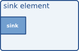

## VNC 
You may use VNC for this lab; if VNC is used, it is strongly recommended to us a reslution less than 4k as resolutions at 4k or higher can cause additional lag.
For example, 
This demo may be used via VNC. If VNC is used, it is strongly recommended to us a reslution less than 4k as resolutions at 4k or higher can cause additional lag when VNC is used. For example, a resolution of 1600x900 typically decent performance (you may adjust as needed).

Make sure your display cable is not plugged into your and NX and from a SSH shell enter: 
```
export DISPLAY=:0
xhost +
sudo xrandr --fb 1600x900
```


## Part 1: GStreamer

In this part of the lab, you'll explore using GStreamer, primally via the gst-launch-1.0 tool.  The sections marked `(Audio)` require an audio device, e.g. USB headphones, and may be considered optional.  

### Basics
At its core GStreamer uses pipelines, where a pipelie is a list of elements separated by exclamation marks (!). 

An element can be thought of as a black box with one or more pads, the element's interface to the outside world; data comes in on one side, the data element does something with it and something else comes out the other side.  There are 3 types of elements, source, filter and filter-like, and sink elements.

Source elements generate data for use by a pipeline, for example reading from from a camera or a file. 


Filters and filter-like elements have both input and outputs pads. They operate on data that they receive on their input (sink) pads, and will provide data on their output (source) pads.


Filter-like elements can have any number of source or sink pads.  For example, a demuxer would have one sink pad and several (1-N) source pads, one for each of the  streams contained in the source format. On the other hand, an decoder will only have one source and sink pads.


Finally, sink elements are the end of a pipeline; they accept an input and outout to a display, to disk, etc.




### Pipelines

The first pipeline will be a simple video test image. 
```
gst-launch-1.0 videotestsrc ! xvimagesink
```

This will display a classic "test pattern". The command is composed of two elements, the videotestsrc and a video sink, xvimagesink.

Running `gst-inspect-1.0 videotestsrc` will provide some additional information on the srs and nne of the properies we can set is the `pattern`.
The patterns have an index number or a name and either may be used.  For example both `gst-launch-1.0 videotestsrc pattern=snow ! xvimagesink` and `gst-launch-1.0 videotestsrc pattern=0 ! xvimagesink` produce the same thing.

Explore the various patterns.

Nvidia also provides a couple of its own accellerated plugins:

- nv3dsink: a window-based rendering sink, and based on X11
- nveglglessink: EGL/GLES video sink
- nvvidconv: a Filter/Converter/Video/Scaler, converts video from one colorspace to another & Resizes
- nvegltransform: tranforms to the EGLImage format.

Try to use the `nv3dsink`.  A simple approach would be running something similar to `gst-launch-1.0 videotestsrc ! nv3dsink`.  Does it work?  ...

Inspecting nv3dsink, we can see that it requires an input of video/x-raw(memory:NVMM).
This is not someting that videotestsrc outputs, so we'll need to use nvvidconv to convert. Inspecting this, we can see it can take video/x-raw and output video/x-raw(memory:NVMM).

gst-launch-1.0 videotestsrc ! nvvidconv ! 'video/x-raw(memory:NVMM)' ! nv3dsink -e
To use nveglglessink, we'll need to use nvvidconv and nvegltransform, to go from NVMM to EGLImage.

gst-launch-1.0 videotestsrc ! nvvidconv ! nvegltransform ! nveglglessink -e
Which sink to use? Will it just depends. xvimagesink is often easier to get going, but the nvidia ones provide additional acceration and perforance.

Note, there are additional Nvidia sinks that may be used, but may not work over technology like VNC, e.g nvdrmvideosink.


python, opencv, and gstreamer

## Part 2: Quantization
Notebook example

Jetson Inference
